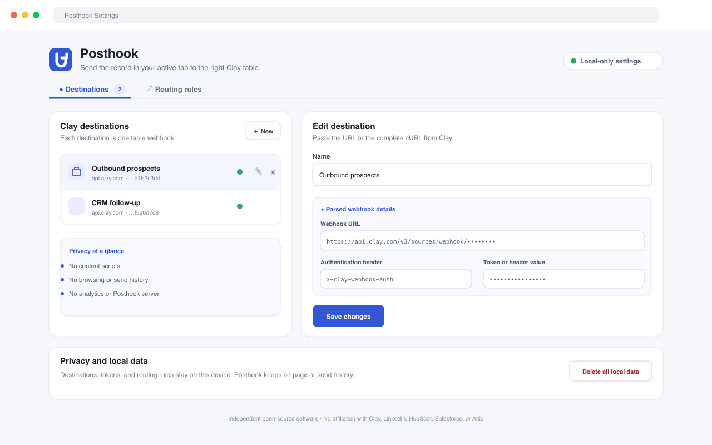

<div align="center">
  

# Posthook

**Send the record open in Chrome to the right Clay table—without scraping the page.**

[](LICENSE)
[](.nvmrc)
[](wxt.config.ts)

</div>

Posthook is a privacy-focused Chrome extension for sending LinkedIn and CRM records to [Clay](https://www.clay.com/) webhooks. It recognizes the active record from its URL, recommends a destination using your routing rules, and sends only when you click **Send**.



## Highlights

- **URL-only record detection** — no content scripts and no page scraping.
- **Multiple Clay destinations** — save a named webhook for each table.
- **Smart routing** — recommend destinations by source, object type, or URL pattern.
- **Local by design** — settings and optional tokens stay in Chrome extension storage.
- **Manual sends only** — no background collection, automatic sends, or retries.
- **Minimal permissions** — only `activeTab`, `storage`, and optional access to Clay's API.

## Supported records

| Source     | Recognized pages                     | `object_type`                             |
| ---------- | ------------------------------------ | ----------------------------------------- |
| LinkedIn   | Profile pages                        | `person`                                  |
| HubSpot    | Standard and custom CRM record pages | Friendly standard type or HubSpot type ID |
| Salesforce | Lightning record pages               | Salesforce object API name                |
| Attio      | Workspace record pages               | Attio object slug                         |

Each send is one JSON `POST` containing exactly four fields:

```json
{
  "source": "salesforce",
  "url": "https://example.my.salesforce.com/lightning/r/Contact/003000000000000AAA/view",
  "record_id": "003000000000000AAA",
  "object_type": "Contact"
}
```

LinkedIn profiles do not expose a stable record ID in the URL, so `record_id` is `null` for that source.

## Install locally

You need Chrome, [Node.js 24](https://nodejs.org/), and npm. Clone or fork the repository, then run from its root:

```bash
npm install
npm run build
```

Then open `chrome://extensions`, enable **Developer mode**, choose **Load unpacked**, and select `.output/chrome-mv3`.

For live development, run `npm run dev`; WXT will open a development browser profile with the extension loaded.

## Configure and use

1. Open Posthook's settings and add a named Clay destination.
2. Paste the table's webhook URL or Clay cURL command.
3. Review the locally parsed URL and optional authentication header, then save.
4. Optionally add guided or regular-expression routing rules.
5. Open a supported record, click Posthook in the toolbar, choose a table, and click **Send**.

Pasted cURL commands are parsed as text and never executed. Their request bodies are ignored.

## Privacy and security

Posthook has no operated server, account system, analytics, telemetry, ads, or send history. It does not read page content, cookies, or browsing history. An optional Clay authentication value is stored on this device in `chrome.storage.local`, which is private to the extension but not encrypted at rest.

The production manifest requests `activeTab` and `storage`. Access to `https://api.clay.com/*` is optional and requested when you save your first destination.

Read the [privacy policy](PRIVACY.md), [permission rationale](docs/permissions.md), [architecture and trust boundaries](docs/architecture.md), and [security policy](SECURITY.md) for details.

## Development

```bash
npm install
npm run check
npm run test:e2e
```

`npm run check` runs linting, formatting checks, TypeScript, unit tests, and a production build. Use `npm run zip` to create a release archive in `.output/`.

Before a release, complete the [manual user-owned webhook check](docs/manual-release-check.md). Tests and fixtures must contain placeholder credentials only.

Contributions are welcome—see [CONTRIBUTING.md](CONTRIBUTING.md) before opening a pull request.

## Project documentation

- [Architecture](docs/architecture.md)
- [Permission rationale](docs/permissions.md)
- [Privacy policy](PRIVACY.md)
- [Chrome Web Store copy](docs/store-listing.md)
- [Release verification](docs/manual-release-check.md)
- [Security policy](SECURITY.md)

## Affiliation and license

Posthook is independent open-source software. It is not affiliated with or endorsed by Clay, LinkedIn, HubSpot, Salesforce, or Attio. Product names and trademarks belong to their respective owners.

Released under the [MIT License](LICENSE).
