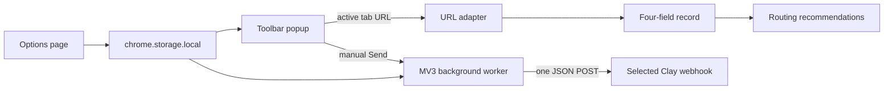

# Architecture

Posthook is a Chrome-only Manifest V3 extension built with WXT, React, and TypeScript.



## Trust boundaries

- URL adapters are isolated by service and accept only HTTPS record shapes.
- The popup sees the active URL after the toolbar action. There are no content scripts or page scraping.
- The background validates the popup record again, finds the destination in local storage, checks optional host permission, and performs one fetch.
- cURL text is tokenized locally, never executed, and never uses pasted request bodies.
- Response bodies are never rendered or logged.
- Routing rules recommend one destination; they cannot send or fan out.

## Storage schema

One versioned object is stored under `posthook_state`:

```ts
interface AppState {
  schemaVersion: 1;
  destinations: Destination[];
  rules: RoutingRule[];
}
```

Invalid entries and rules referencing missing destinations are discarded during normalization. Deleting a destination cascades to its rules.

## Network behavior

Posthook connects only to validated `https://api.clay.com/.../sources/webhook/...` destinations. A send uses `POST`, `Content-Type: application/json`, an optional user-configured auth header, a 12-second timeout, and no automatic retry.
