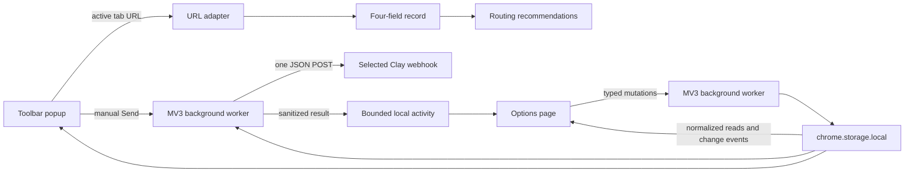

# Architecture

Push Row is a Chrome-only Manifest V3 extension built with WXT, React, and TypeScript.



## Trust boundaries

- URL adapters are isolated by service and accept only HTTPS record shapes.
- The popup sees the active URL after the toolbar action. There are no content scripts or page scraping.
- The background validates the popup record again, finds the destination in local storage, checks optional host permission, and performs one fetch.
- cURL text is tokenized locally, never executed, and never uses pasted request bodies.
- Response bodies, webhook URLs, and authentication values are never written to activity.
- Routing rules recommend one destination; they cannot send or fan out.

## Storage schema

Configuration is stored as one versioned object under `pushrow_state`:

```ts
interface AppState {
  schemaVersion: 1;
  destinations: Destination[];
  rules: RoutingRule[];
}
```

Invalid entries and rules referencing missing destinations are discarded during normalization. Deleting a destination cascades to its rules.

Popup and options contexts read normalized state and subscribe to storage changes. All configuration mutations are validated and serialized by the background worker so concurrent extension contexts cannot overwrite one another's updates.

Activity is isolated under `pushrow_activity` so background result writes cannot overwrite configuration. Its versioned state contains a retention limit from 0–100 and the bounded activity entries. Every entry is reconstructed into the documented shape during normalization so unknown fields are discarded.

## Source organization

- `src/entrypoints/` contains only WXT mounting and background-registration adapters.
- `src/background/`, `src/popup/`, and `src/options/` contain runtime-specific orchestration and UI.
- `src/shared/` contains pure domain logic; `src/platform/` owns browser APIs and storage access.
- `src/integrations/` contains the outbound Clay client.

WXT generates the complete unpacked extension in `dist/`; source and store-only assets are excluded from that directory.

## Network behavior

Push Row connects only to validated `https://api.clay.com/.../sources/webhook/...` destinations. A send uses `POST`, `Content-Type: application/json`, an optional user-configured auth header, a 12-second timeout, and no automatic retry.
